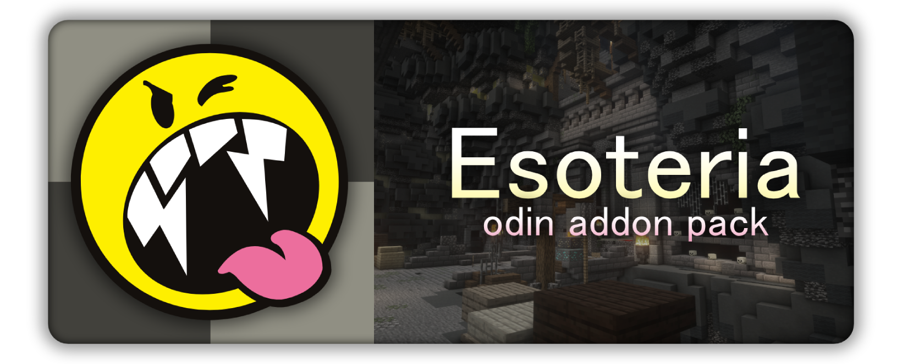

# Esoteria

Esoteria is an slightly funny Odin addon focused on qol visuals for Dungeons.

The specific purpose this addon serves is to help you be a more decisive player. Play the game with the ability to just turn your brain off and rely on what you're seeing.

## Modules

- `Doorman` - Better vision for doors currently in your room.
- `Stars` - Better vision for mobs currently in your room, replace the default Odin Highlight with this.
- `3x3 Overlay` - Renders the Necron 3x3 overlay while inside of the boss fight.

## Requirements

- Minecraft `1.21.10`
- Fabric Loader
- Odin (Fabric)